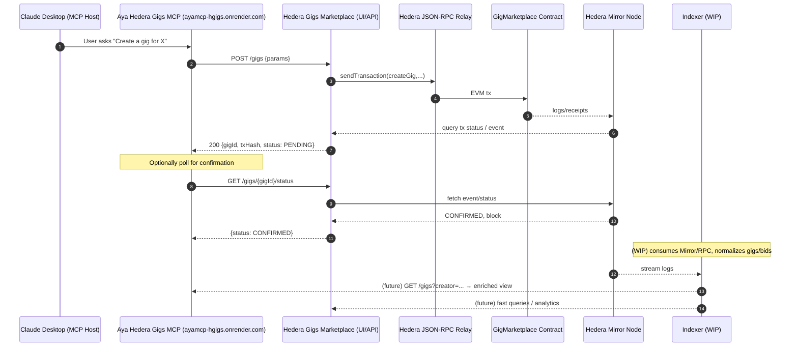

```mermaid
sequenceDiagram
  autonumber
  participant Claude as Claude Desktop (MCP Host)
  participant MCP as Aya Hedera Gigs MCP (ayamcp-hgigs.onrender.com)
  participant DApp as Hedera Gigs Marketplace (UI/API)
  participant RPC as Hedera JSON-RPC Relay
  participant Contract as GigMarketplace Contract
  participant Mirror as Hedera Mirror Node
  participant IDX as Indexer (WIP)

  Claude->>MCP: User asks "Create a gig for X"
  MCP->>DApp: POST /gigs {params}
  DApp->>RPC: sendTransaction(createGig,...)
  RPC->>Contract: EVM tx
  Contract-->>Mirror: logs/receipts
  Mirror-->>DApp: query tx status / event
  DApp-->>MCP: 200 {gigId, txHash, status: PENDING}

  Note over MCP: Optionally poll for confirmation
  MCP->>DApp: GET /gigs/{gigId}/status
  DApp->>Mirror: fetch event/status
  Mirror-->>DApp: CONFIRMED, block#, event
  DApp-->>MCP: {status: CONFIRMED}

  Note over IDX: (WIP) consumes Mirror/RPC, normalizes gigs/bids
  Mirror-->>IDX: stream logs
  IDX-->>MCP: (future) GET /gigs?creator=... → enriched view
  IDX-->>DApp: (future) fast queries / analytics
```